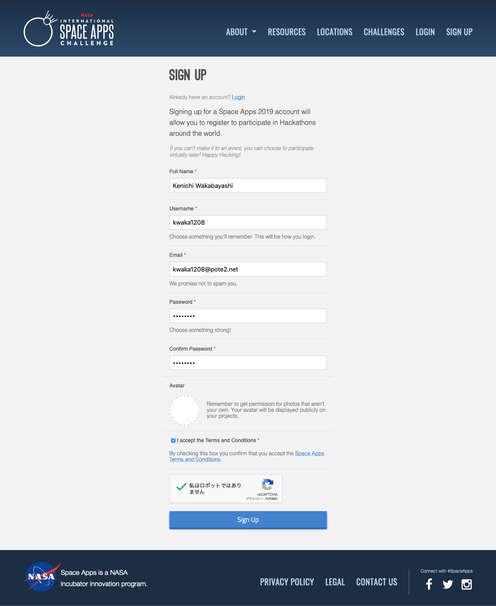

# NASA Space Apps Challenge 2019

NASA Space Apps Challenge KUSIHMOTO 2019に関連する情報を適宜ここに載せていきます。情報の追加を行ったら、随時お知らせします。

## 参照するドキュメント
### [2019年チャレンジ要約集](https://blog.spaceapps.jp/entry/2019/10/05/000059)
今年のSpace Apps Challengeで開発するもののテーマ・ストーリーです。これに合致していることが審査基準のひとつになります。Global審査に進むためには、この中のいずれかに合致してなければなりません。

### [NASA Space Apps Challenge Slackワークスペース](https://join.slack.com/t/spaceappsjapan2019/shared_invite/enQtNjg4ODg5Mzg2MDIzLThjMWNlMTNlMTkxMzg3MTZkZTQyNDQ1ODBhMTRhZDQ1M2U5OWQ3ZGMyZDc4MmUzOWI2YzlhNjJiZmRhZGQ3NmM)
日本全国のSpace Apps Challenge参加者のためのSlackワークスペースです。NASAのデータに詳しい方も参加しているので、ぜひ参加しておいてください。Space Apps Challengeに関係する質問全般も受け付けています。

### [NASA Open Data](https://data.nasa.gov)
NASAが公開するオープンデータのポータルサイト

## NASA公式エントリー方法

1. [NASA Space Apps Challenge公式サイト](https://spaceappschallenge.org)にアクセスする。
2. 右上のSIGN UPをクリックし、アカウント登録をする。入力する内容は以下の通り。  

	- Full Name（本名）
	- Username（アカウント名）
	- E-Mail（メールアドレス）
	- Password（パスワード）
	- Confirm Password（確認用パスワード）
	- Avator（アイコン画像）←設定しなくても大丈夫です。
	- I accept the Terms and Conditions（利用規約の同意確認）
3. 登録すると、"Welcome to Space Apps! - Please Verify Your Account"というタイトルのメールが送られてくるので、メールの中のリンクをクリック。
4. Event Registrationで参加都市を選択 (検索窓で"kushimoto"と入力してください)

この後は、まずチームリーダーがチームを作って、その後メンバーがチームに参加するという手順になります。チームリーダーをひとり決めて、チーム作成を行なってください。

### チームリーダー（チーム作成）
1. チーム作成[チャレンジのページ](https://2019.spaceappschallenge.org/challenges/)にアクセスして、そのチームが取り組むチャレンジを選びます。
2. 次にTeamsタブを選び、「Start a Team」をクリックしてチーム作成します。

### チームメンバー（チーム参加）
1. - 他のメンバーは[チャレンジのページ](https://2019.spaceappschallenge.org/challenges/)にアクセスして、右側の「Find a Team」からチーム名を検索して自分のチームを見つけ、MembersタブからJoin Teamボタンをクリックして参加する。

## 審査基準
グローバル審査のプロジェクトは、以下の基準で審査されます。[原文はこちら](https://www.spaceappschallenge.org/about/judging/)

### 影響
このプロジェクトは、テーマに対してどのような影響（品質と量）を与えますか？大きな問題と小さな問題のどちらを解決できますか？またはインスピレーションを与えたり、何かの助けになるようなものですか？

### 創造性
アプローチはどの程度創造的/革新的ですか？ プロジェクトは斬新で、これまでに試みられたことがないものですか、それとも既存のものの漸進的な改善ですか？

### 有効性
ソリューションは科学的に有効ですか？ 意図したことを実現しますか？ 現実の世界で機能しますか？

### 関連性
このプロジェクトは、提出された課題に対応していますか？ それは完全な解決策ですか、それとも最終ゴールまでにまだ長い道のりがありますか？技術的に実行可能ですか？ソリューションはどの程度使いやすいですか、ユーザーフレンドリーですか？

### プレゼンテーション
チームはプロジェクトをどの程度うまく伝えましたか？ プロジェクトのストーリー、つまり課題、解決策、そしてなぜそれが重要なのかを伝えるのに効果的でしたか？